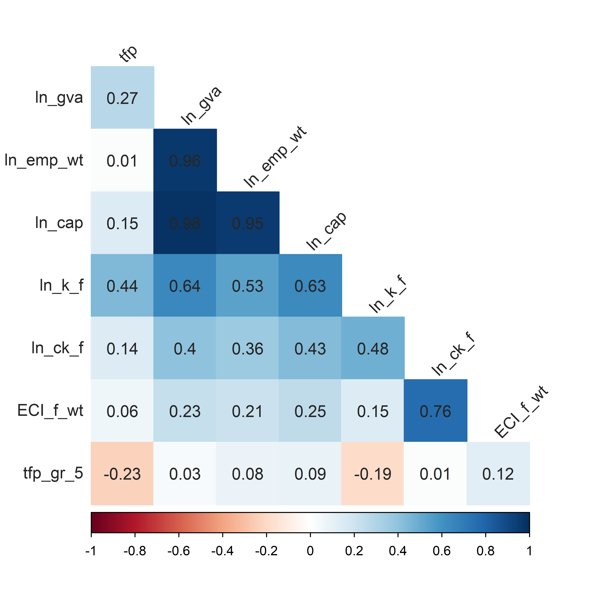

# Background and motivation

The ability to create and adapt new knowledge as a pre-requisite for
successful innovation is widely considered as an important driver for the
competitiveness and productivity of firms, and accordingly the regions where these firms
are located (see e.g. Malecki, 2014). Therefore, the development and
application of indicators on knowledge production has become one of
the central concerns not only in a scientific context per se, but increasingly 
as a major instrument to orientate and evaluate research and
innovation policies (see e.g. Godin, 2003; Katz, 2006), often referred to
under the notion of policy learning and evidence-based policy making
(Borras and Laatsit, 2019; Sanderson, 2002). In this context, many
scholars point to the growth of the *indicators landscape* in terms of
quantity and data availability, which is at the same time characterised
by more limitations in times of increased complexity of innovation
processes and systems (see e.g. Freeman and Soete, 2009).  

One weakness that we can specifically observe of indicators on
knowledge production – with knowledge production considered as the
main underlying driver for innovation – is its focus on *quantity*. In other
words, common indicators measuring knowledge production activities,
often derived from patenting information, focus on pure quantitative
counts of some knowledge outputs, relating such outputs to innovative
outcomes. This is also common practice for most policy-oriented indicator systems, 
such as the European innovation scoreboard (Hollanders
et al., 2009). Accordingly, in such works it is implicitly assumed that all
knowledge has the same value, i.e. the quality of knowledge is often
neglected (Balland and Rigby, 2017). 

Against this background, the notion of *knowledge complexity* has
come into play more prominently in the recent past (see e.g. Balland and
Rigby, 2017). Within this conception, the complex nature of knowledge
is associated with its value and quality in terms of accessibility and
mobility in (geographical) space, with a higher complexity reflecting
increasing quality but decreasing accessibility for others due to its
higher degree of *tacitness* and, accordingly, spatial *stickiness*. In
essence, the approach is derived from the work presented by Hidalgo
and Hausmann (2009) who introduced the complexity notion to grasp
the ability of countries to export non-ubiquitous product groups. This
was transferred to the concept of knowledge complexity, and to the
regional level (Balland and Rigby, 2017; Ivanova et al., 2017; Pintar and
Scherngell, 2018) as an equivalent in terms of the knowledge domains
regions are capable of. From the perspective of complexity and systems
theory (Fleming and Sorenson, 2001; Kauffman, 1993; Simon, 1962),
the complexity of knowledge can be well related to the variety of
differing knowledge components it contains, and the interdependencies
of those components.

With its focus on knowledge complexity, this study lies in the vein of
the research stream exploring knowledge production processes and their
dynamics, but takes a spatial economics and regional policy perspective
in its conceptualisation and application. The objective is to advance
measures for regional knowledge complexity, and to apply them to a set
of European regions, highlighting its potential in a regional policy
context. Furthermore, we apply the regional knowledge
complexity measures to a new and more meaningful set of European
regions. Most works investigating regional knowledge production rely
on standard administrative classifications (mostly NUTS-2) that might
artificially intersect agglomerations of knowledge creation (cities)
leading to problematic interpretations in a spatial context (Lepori et al.,
2019). If a considerable share of residents in areas close to or around
large cities commute to work, economic activity in these commuter belts
should be counted towards the main city, essentially creating functional
areas. The so-called *metropolitan regions* defined by EUROSTAT (2019) 
- which we use in this study as a unit of observation -  aim to do that. 
The final contribution of this study is to relate regional knowledge
complexity - compared to non-complex knowledge production -  to regional productivity in a spatial regression framework. 
As regions are increasingly embedded into their surroundings in their knowledge production activities - be it via formal or informal research and development collaborations - it is important to relax the independent observation assumption of basic linear regression models and explicitly take space into account. Specifically, we employ a spatial durbin model (SDM) that introduces a spatially lagged dependent variable and multiple spatially lagged independent variables to explain regional knowledge production. In order to also explore whether different subsets of the population of regions are differently equipped  to properly extract economic (or productivity) gain from complex knowledge production, an effort is made to estimate a spatially eigenvector filtered unconditional quantile regression.


# Methods and empirical approach

## Operationalisation of knowledge complexity \label{sec:oper}

The concept of economic complexity
grasps the ability of countries to export non-ubiquitous product groups,
which can only be traded by relatively few countries. The fact that a
country is able to export such sophisticated products competitively
should signal the existence of a large set of necessary latent (technological) capabilities which in turn should constitute a competitive advantage. Indeed, economic complexity has been shown to be superior
in predicting future economic growth of a country to other indicators
such as education and institutional quality (Hausmann et al., 2011). This
fundamental concept of economic complexity can be very well translated to (regional) knowledge production and has recently been applied in the context of knowledge complexity.
In this study, we follow this recent research direction of employing
the approach of Hidalgo and Hausmann (2009) to capture the
complexity of knowledge of spatial entities (countries or regions), using
their technological patent portfolio (patents of a specific technological
domain applied for in a specific region). Then we combine – in the same way as done
with exports for the economic complexity index – the diversity and
ubiquity of the citation-adjusted patent portfolio of a country/region in
a knowledge complexity index for countries or regions (see e.g. Antonelli et al., 2017; Balland et al., 2019; Balland and Rigby, 2017; Ivanova et al., 2017; Whittle, 2017). In terms of interpretation, the knowledge complexity
index proposed by Balland and Rigby (2017) - and applied in this study - of countries or regions is
understood as their ability to create and sustain knowledge bases that
are non-ubiquitous in the system.

More specifically, a region’s knowledge complexity is understood as a function of its diversity in terms of different technologies produced, and the ubiquity of these technologies, i.e. how many other regions are capable of producing and
‘exporting’ knowledge related to a specific technological field. Accordingly, the knowledge complexity of regions is based on the region-by-technology network matrix, representing the technological
portfolio of all regions as it connects each spatial entity $i=(1\ldots N)$ with technological fields $i=(1\ldots K)$ in which it is specialised in. Similar to previous literature we use the concept of Revealed Comparative
Advantage (RCA) by Balassa (1965) to find apparent specialisations of regions in technologies for the time period given by $t$ (subscript t omitted for clarity purposes).

\begin{align}
RCA_{ik} = \frac{X_{ik}}{\sum_k X_{ik}} / \frac{\sum_i X_{ik}}{\sum_i \sum_k X_{ik}}
\end{align}

The RCA of a region in a specific technological field is the ratio between the share of the regions’ knowledge production in this field and the share of the same technological field in the whole sample. $X_{ik}$ can be
any proxy of knowledge production of region $i$ in technology $k$. Similar to the majority of related literature, We use patent applications to account  for knowledge production. A value larger than one signals a relative regional specialisation in the specific field. Consequently, we define the matrix $M$ as 


\begin{align}
M_{ik} =  \begin{cases} &\text{1 } \ if \  RCA_{ik} >1 \\
                &\text{0 } \ if \ RCA_{ik} \le 1,
                \end{cases}
\end{align}

i.e. elements are set to 1 if a region is specialised in a certain technology,
and to zero otherwise. $M$ can – from a graph theoretic perspective – also
be described as a bipartite graph with two distinct sets of nodes (the $N$
regions and $K$ technological fields) where only nodes of different types
can be connected. Region $i$ is connected to field $k$ in the European
knowledge production network if, and only if, $M_{ik}=1$. The diversity in
knowledge production of region $i$ is then simply given by its degree
centrality, $d_i=\sum_k M_{ik}$. Analogously, the ubiquity of $k$ is equal to its
degree centrality, $u_k=\sum_i M_{ik}$. Hidalgo and Hausmann (2009) introduced the so-called *Method of Reflections* in order to infer the complexity of countries (and products) from the network of global exports of
products. Translated to our notation and applied to knowledge production, this iterative, self-referential algorithm (see eq. \ref{eq-mr}) takes regional diversification and the ubiquity of technological fields
and then recursively refines these variables with $n$ iterations to
yield estimates of regional and technological complexity $(d_i^n ; u_k^n)$.

\begin{align} \label{eq:mr}
\begin{cases}
d_i^n = \frac{1}{d_i^0} \sum_k M_{ik} \ u_k^{n-1} \\
u_k^n = \frac{1}{u_k^0} \sum_i M_{ik} \ d_i^{n-1}
\end{cases}
\end{align}

In other words, this algorithm produces generalised measures of
diversification and ubiquity where each iteration uses information from
previous iterations to yield a finer estimate of regional and technological
complexity, respectively. Each even iteration of $d_i^n$ is a finer estimate of
regional knowledge complexity, calculated as the average ubiquity of
technological fields (at iteration (n − 1)) in which this region is specialised in. Analogously, each uneven iteration of $u_k^n$ produces a better estimate of technological complexity as the average diversification of
regions (at iteration (n − 1)) that are able to produce knowledge in that
particular field.

## Theoretical framework and modelling approach

## Data

As elaborated in the previous section, the main focus of this study is to analyse the relationship between regional complex knowledge capital and regional productivity while at the same time explicitly accounting for spatial dependence and spatial heterogeneity in regional innovation activities. We proxy regional innovation activities or knowledge production with patent applications to the European patent office (EPO) by inventors within *metropolitan regions* defined by EUROSTAT (2019). These regions aim to capture urban agglomerations in Europe and defined as aggregates of NUTS-3 regions where at least 50\% of the population lives inside a functional urban area that is composed of $250.000$ or more inhabitants. 

We retrieve patent applications to the European Patent Office (EPO) by EU and EFTA inventors between
1996 and 2016 from the OECD REGPAT database, which offers regionalised patent data. Patents are allocated to NUTS-3 regions in the REGPAT database, where patents are attributed to regions by inventor residence. We map patents located in these NUTS-3 regions to *metropolitan regions* as defined by EUROSTAT and remove (fractional) patents that are located in peripheral regions according to this classification. Similar to related literature, we define knowledge capital as aggregates of patent applications of regional inventors using a five-year moving window. Patent applications associated with the year 2000 (the first period in the sample), for example, are then the sum of patent applications from years 1996 to 2000.  

Using patents mapped to *metropolitan regions* regions, it is then possible to calculate regional knowledge complexity scores for each period 2000-2016, following elaborations in Section \ref{sec:oper} and specifically Equation \ref{eq:mr}. Regional complex knowledge capital is then defined as the complexity weighted regional knowledge capital.
 
Regional productivity is calculated using regional output and regional production factor inputs of labour and capital.  
We define the regional total factor productivity index ($p$) adapted from Caves et al. (1982).


\begin{align}
p_{it} = q_{it} - s \, l_{it} - (1-s) \, c_{it}
\end{align}

Lower case letters refer to variables in logged form. Here, lower case $s$ is the assumed share of labour costs in the production process. Similar to related studies (e.g. Beugelsdijk, Klasing and Milionis, 2018), we set s equal
to $2/3$. Regional output ($q$) is measured via real regional gross value added. Labour input ($l$) is
the number of employees, adjusted by differences in the average working hours per country.
The capital stock of a region is defined as the five year sum of past real gross fixed capital
formation (investment). All non-patent variables described above are sourced for the period 2000 to 2021 from ARDECO. As the growth of productivity is arguably even more of relevance for policy decisions than the level of productivity per se, we focus in this analysis on the five-year growth rate of productivity as our main dependent variable. We define the five-year growth rate of productivity as the difference of $p_{i(t+5)}-p_{it}$. Consequently, the last year under investigation is $t=2016$ where the dependent variable refers to TFP growth from 2016 to 2021. 

Keeping only regions that produce at $50$ patent applications per period (which is necessary to assure sensible knowledge complexity scores) and regions where output, labour and capital data is available until 2021, yields a balanced panel with 192 *metropolitan regions* and 17 time periods (2000-2016).

# Analysing European regional knowledge complexity in *R*

## Setup

Setting **knitr** options allows to define sensible standard settings for *echo*, *warning*, etc. as well as to define automatic saving of figures that are implemented in the quarto document.


::: {.cell}

```{.r .cell-code}
knitr::opts_chunk$set(echo = TRUE, warning=FALSE, message=FALSE, fig.path='Figs/', dpi = 750)
```
:::


Below I define a vector of packages needed in the following script that are all installed (if necessary) and attached. I will mention and describe the usage specific packages in the following text, if relevant.


::: {.cell}

```{.r .cell-code}
r = getOption("repos")
r["CRAN"] = "https://cran.wu.ac.at/"
options(repos = r)

## packages
list.of.packages <- c('MASS', 'rlang', "tidyverse", 'dplyr','tibble','purrr','slider',
                      'foreign','extrafont',
                      'grid', 'gridExtra', 
                      'ggplot2', 'ggrepel', 'lemon','viridis','colorspace',
                      'scales','wesanderson','RColorBrewer','ggthemes', 
                      'bookdown','knitr',
                      'kableExtra', 'DescTools',
                      'lme4','withr',
                      'tictoc',
                      'corrr','psych','corrplot',
                      'rgdal','spdep','sf','rnaturalearth',
                      'plm','splm','GWPR.light','spatialreg', 'modelsummary', 'broom',
                       'stargazer', 'export')

new.packages <- list.of.packages[!(list.of.packages %in% installed.packages()[,"Package"])]
if(length(new.packages)) install.packages(new.packages)
invisible(lapply(list.of.packages, require, character.only = TRUE))

#load own package Pmisc, separate because devtools::install_github needs to be used
#devtools::install_github("PintarN/Pmisc")
library('Pmisc')
```
:::


## Descriptive analysis

### Data preparation

For data manipulation and basic calculations I use almost exclusively functions and syntax from the [**tidyverse**](https://www.tidyverse.org/). This set of packages (including for example **dplyr**) introduces a variety of functions for several data handling or data science operations. Furthermore it introduces a intuitive way to link operations on a single object with the so-called *pipe* (%>%). 


::: {.cell}

```{.r .cell-code}
#load balanced panel with data
metro.panel.load <- readRDS(file = '../data/metro_balanced_panel_calc_070124.rds')

#limiting to main variables and renaming to make consistent
#the suffix _f always refers to fractional counting of patents, ck refers to 
#complex knowledge capital whereas k refers to knowledge capital, 
#ECI refers to the economic complexity index (which is used to proxy complex knowledge) 
#and ECI_f_wt then to the complexity weight used to weight knowledge capital to yield complex knowledge capital
metro.panel <- metro.panel.load %>% 
  dplyr::select(metro_code, metro_name, year,tfp, 
                ln_gva, ln_emp_wt, ln_cap, ln_k_f, 
                ln_ck_f = ln_kc_f,ECI_f_wt)
```
:::

::: {.cell}

```{.r .cell-code}
#calculate five-year growth rates of tfp, the main dependent variable
metro.panel <- metro.panel %>% dplyr::group_by(metro_code) %>% dplyr::mutate(
  tfp_gr_5 = dplyr::lead(tfp,5) - dplyr::lead(tfp,0),
  tfp_gr_5_pt = 100*tfp_gr_5
  ) %>% ungroup()
```
:::


I store my data in *tibbles* which is a form of *dataframe* and behaves basically the same with a few cosmetic differences. The main dataset looks as follows:


::: {.cell}

```{.r .cell-code}
metro.panel
```

::: {.cell-output .cell-output-stdout}
```
# A tibble: 4,224 x 12
   metro_code metro_name       year   tfp ln_gva ln_emp_wt ln_cap ln_k_f ln_ck_f
   <chr>      <chr>           <dbl> <dbl>  <dbl>     <dbl>  <dbl>  <dbl>   <dbl>
 1 AT001MC    Wien             2000  2.78  11.4       7.07  11.7    7.17   7.11 
 2 AT002M     Graz             2000  2.69   9.76      5.64   9.93   6.14   5.92 
 3 AT003M     Linz             2000  2.74  10.1       5.93  10.3    6.39   1.79 
 4 AT004M     Salzburg         2000  2.80   9.44      5.21   9.52   5.56   4.15 
 5 AT005M     Innsbruck        2000  2.75   9.16      4.97   9.30   5.06   3.78 
 6 BE001MC    Bruxelles / Br~  2000  3.06  11.4       6.86  11.4    7.53   6.77 
 7 BE002M     Antwerpen        2000  2.96  10.4       5.92  10.5    6.69   7.46 
 8 BE003M     Gent             2000  2.88   9.74      5.41   9.77   6.19   6.32 
 9 BE004M     Charleroi        2000  2.89   9.10      4.82   9.00   5.16   0.554
10 BE005M     Liège            2000  2.80   9.58      5.31   9.72   5.80   1.19 
# i 4,214 more rows
# i 3 more variables: ECI_f_wt <dbl>, tfp_gr_5 <dbl>, tfp_gr_5_pt <dbl>
```
:::
:::


Before doing any proper data analysis, I create summary descriptive statistics for each variable and each year.


::: {.cell}

```{.r .cell-code}
#create list of all numeric variables of interest
summary.variables <- as.list(metro.panel %>% dplyr::select(-year) %>% 
                               dplyr::select_if(~ is.numeric(.)) %>% colnames())

names(summary.variables) <- metro.panel %>% dplyr::select(-year) %>% 
  dplyr::select_if(~ is.numeric(.)) %>% colnames()

#calculate yearly summary statistics, exemplary for tfp, tfp growth and ln_ck_f

#tfp
zeros <- metro.panel %>% group_by(year) %>% select(year, tfp) %>% 
  dplyr::count(zeros = tfp ==0) %>% dplyr::filter(zeros == T) %>% 
  select(-zeros) %>% dplyr::rename(zeros = n)

summary.variables$tfp <- metro.panel %>% group_by(year) %>% 
  select(year, tfp) %>% dplyr::summarise(summary = list(summary(tfp)))  %>% 
  tidyr::unnest_auto(col = summary) %>% dplyr::left_join(zeros, by = 'year') 

#tfp growth
zeros <- metro.panel %>% group_by(year) %>% select(year, tfp_gr_5_pt) %>% 
  dplyr::count(zeros = tfp_gr_5_pt ==0) %>% dplyr::filter(zeros == T) %>% 
  select(-zeros) %>% dplyr::rename(zeros = n)

summary.variables$tfp_gr_5_pt <- metro.panel %>% group_by(year) %>% 
  select(year, tfp_gr_5_pt) %>% dplyr::summarise(summary = list(summary(tfp_gr_5_pt)))  %>% 
  tidyr::unnest_auto(col = summary) %>% dplyr::left_join(zeros, by = 'year') 

#ln_ck_f
zeros <- metro.panel %>% group_by(year) %>% select(year, ln_ck_f) %>% 
  dplyr::count(zeros = ln_ck_f ==0) %>% dplyr::filter(zeros == T) %>% 
  select(-zeros) %>% dplyr::rename(zeros = n)

summary.variables$ln_ck_f <- metro.panel %>% group_by(year) %>% 
  select(year, ln_ck_f) %>% dplyr::summarise(summary = list(summary(ln_ck_f))) %>% 
  tidyr::unnest_auto(col = summary) %>% dplyr::left_join(zeros, by = 'year') 
```
:::


### Basic descriptives

Using **kableExtra** I can easily create formatted latex tables that are included in the report.


::: {.cell}

```{.r .cell-code}
#tfp
#change 1d table in df to double for kable to work
summary.table.tfp <- summary.variables$tfp %>% 
  mutate(dplyr::across(.cols = 2:8, as.numeric))

#use kable to format and create latex code for table
kableExtra::kable(summary.table.tfp, format = 'latex', digits = 2,row.names = F, 
                  caption = 'TFP summary statistics \\label{tab:summ-tfp}') %>% 
  kable_styling(font_size = 7)
```

::: {.cell-output-display}
\begin{table}

\caption{\label{tab:summaries}TFP summary statistics \label{tab:summ-tfp}}
\centering
\fontsize{7}{9}\selectfont
\begin{tabular}[t]{r|r|r|r|r|r|r|r}
\hline
year & Min. & 1st Qu. & Median & Mean & 3rd Qu. & Max. & zeros\\
\hline
2000 & 1.80 & 2.70 & 2.78 & 2.77 & 2.88 & 3.36 & NA\\
\hline
2001 & 1.87 & 2.70 & 2.78 & 2.77 & 2.88 & 3.33 & NA\\
\hline
2002 & 1.88 & 2.71 & 2.78 & 2.77 & 2.87 & 3.32 & NA\\
\hline
2003 & 1.90 & 2.71 & 2.79 & 2.78 & 2.88 & 3.32 & NA\\
\hline
2004 & 1.93 & 2.73 & 2.81 & 2.80 & 2.90 & 3.33 & NA\\
\hline
2005 & 1.97 & 2.73 & 2.82 & 2.81 & 2.90 & 3.34 & NA\\
\hline
2006 & 2.01 & 2.74 & 2.84 & 2.82 & 2.92 & 3.37 & NA\\
\hline
2007 & 2.03 & 2.74 & 2.84 & 2.83 & 2.92 & 3.40 & NA\\
\hline
2008 & 2.06 & 2.73 & 2.83 & 2.82 & 2.92 & 3.34 & NA\\
\hline
2009 & 2.00 & 2.71 & 2.80 & 2.78 & 2.87 & 3.32 & NA\\
\hline
2010 & 2.02 & 2.71 & 2.82 & 2.81 & 2.89 & 3.33 & NA\\
\hline
2011 & 2.05 & 2.73 & 2.83 & 2.83 & 2.92 & 3.30 & NA\\
\hline
2012 & 2.05 & 2.74 & 2.83 & 2.83 & 2.92 & 3.33 & NA\\
\hline
2013 & 2.07 & 2.76 & 2.84 & 2.84 & 2.93 & 3.39 & NA\\
\hline
2014 & 2.07 & 2.77 & 2.85 & 2.85 & 2.93 & 3.36 & NA\\
\hline
2015 & 2.11 & 2.77 & 2.85 & 2.85 & 2.94 & 3.88 & NA\\
\hline
2016 & 2.10 & 2.77 & 2.86 & 2.86 & 2.93 & 3.68 & NA\\
\hline
2017 & 2.11 & 2.78 & 2.86 & 2.86 & 2.94 & 3.64 & NA\\
\hline
2018 & 2.12 & 2.77 & 2.86 & 2.85 & 2.92 & 3.62 & NA\\
\hline
2019 & 2.15 & 2.77 & 2.85 & 2.85 & 2.92 & 3.46 & NA\\
\hline
2020 & 2.08 & 2.70 & 2.79 & 2.79 & 2.86 & 3.66 & NA\\
\hline
2021 & 2.13 & 2.72 & 2.82 & 2.82 & 2.89 & 3.75 & NA\\
\hline
\end{tabular}
\end{table}
:::

```{.r .cell-code}
#tfp growth
#change 1d table in df to double for kable to work
summary.table.tfp.gr <- summary.variables$tfp_gr_5_pt %>% 
  mutate(dplyr::across(.cols = 2:8, as.numeric))

#use kable to format and create latex code for table
kableExtra::kable(summary.table.tfp.gr, format = 'latex',digits = 2,row.names = F,
                  caption = 'TFP five-year growth, summary statistics \\label{tab:summ-tfpgr}') %>% 
  kable_styling(font_size = 7)
```

::: {.cell-output-display}
\begin{table}

\caption{\label{tab:summaries}TFP five-year growth, summary statistics \label{tab:summ-tfpgr}}
\centering
\fontsize{7}{9}\selectfont
\begin{tabular}[t]{r|r|r|r|r|r|r|r|r}
\hline
year & Min. & 1st Qu. & Median & Mean & 3rd Qu. & Max. & NA's & zeros\\
\hline
2000 & -9.07 & 0.03 & 2.78 & 3.78 & 7.48 & 21.69 & NA & NA\\
\hline
2001 & -9.84 & 1.54 & 4.76 & 5.00 & 8.24 & 19.77 & NA & NA\\
\hline
2002 & -14.42 & 1.26 & 4.43 & 5.42 & 9.19 & 21.68 & NA & NA\\
\hline
2003 & -9.92 & 0.21 & 3.61 & 4.34 & 8.33 & 18.32 & NA & NA\\
\hline
2004 & -12.77 & -4.13 & -1.16 & -1.09 & 1.98 & 19.55 & NA & NA\\
\hline
2005 & -10.16 & -3.37 & -0.89 & -0.19 & 2.62 & 18.34 & NA & NA\\
\hline
2006 & -12.21 & -3.10 & -0.33 & 0.25 & 2.72 & 23.57 & NA & NA\\
\hline
2007 & -13.40 & -3.40 & -0.56 & -0.05 & 3.26 & 17.56 & NA & NA\\
\hline
2008 & -15.90 & -1.06 & 1.41 & 1.86 & 5.01 & 28.91 & NA & NA\\
\hline
2009 & -14.36 & 3.19 & 5.87 & 6.21 & 8.94 & 30.85 & NA & NA\\
\hline
2010 & -27.05 & 1.39 & 4.14 & 4.54 & 6.99 & 73.70 & NA & NA\\
\hline
2011 & -25.90 & -0.14 & 2.71 & 3.05 & 5.62 & 43.18 & NA & NA\\
\hline
2012 & -21.42 & 0.24 & 3.21 & 3.22 & 6.11 & 40.50 & NA & NA\\
\hline
2013 & -34.03 & -0.80 & 1.70 & 1.45 & 4.03 & 44.74 & NA & NA\\
\hline
2014 & -36.14 & -1.61 & 0.29 & 0.36 & 2.71 & 16.67 & NA & NA\\
\hline
2015 & -36.77 & -8.77 & -4.74 & -6.26 & -2.10 & 9.55 & NA & NA\\
\hline
2016 & -27.68 & -6.43 & -3.18 & -3.99 & -0.81 & 11.19 & NA & NA\\
\hline
2017 & NA & NA & NA & NaN & NA & NA & 192 & NA\\
\hline
2018 & NA & NA & NA & NaN & NA & NA & 192 & NA\\
\hline
2019 & NA & NA & NA & NaN & NA & NA & 192 & NA\\
\hline
2020 & NA & NA & NA & NaN & NA & NA & 192 & NA\\
\hline
2021 & NA & NA & NA & NaN & NA & NA & 192 & NA\\
\hline
\end{tabular}
\end{table}
:::

```{.r .cell-code}
#complex knowledge capital 
#change 1d table in df to double for kable to work
summary.table.ck <- summary.variables$ln_ck_f %>% 
  mutate(dplyr::across(.cols = 2:8, as.numeric))

#use kable to format and create latex code for table
kableExtra::kable(summary.table.ck, format = 'latex',digits = 2,row.names = F,
                  caption = 'Complex knowledge capital, summary statistics \\label{tab:summ-ck}') %>% 
  kable_styling(font_size = 7)
```

::: {.cell-output-display}
\begin{table}

\caption{\label{tab:summaries}Complex knowledge capital, summary statistics \label{tab:summ-ck}}
\centering
\fontsize{7}{9}\selectfont
\begin{tabular}[t]{r|r|r|r|r|r|r|r|r}
\hline
year & Min. & 1st Qu. & Median & Mean & 3rd Qu. & Max. & NA's & zeros\\
\hline
2000 & 0.54 & 4.05 & 5.31 & 5.29 & 6.56 & 10.38 & NA & NA\\
\hline
2001 & 0.56 & 4.29 & 5.36 & 5.46 & 6.62 & 10.48 & NA & NA\\
\hline
2002 & 0.63 & 4.49 & 5.42 & 5.52 & 6.60 & 10.60 & NA & NA\\
\hline
2003 & 0.37 & 4.30 & 5.52 & 5.49 & 6.55 & 10.56 & NA & NA\\
\hline
2004 & 0.34 & 4.37 & 5.50 & 5.51 & 6.67 & 10.55 & NA & NA\\
\hline
2005 & 0.47 & 4.41 & 5.44 & 5.48 & 6.71 & 10.43 & NA & NA\\
\hline
2006 & 0.46 & 4.19 & 5.61 & 5.49 & 6.79 & 10.47 & NA & NA\\
\hline
2007 & 0.55 & 4.50 & 5.56 & 5.47 & 6.68 & 10.46 & NA & NA\\
\hline
2008 & 0.53 & 4.36 & 5.64 & 5.48 & 6.79 & 10.48 & NA & NA\\
\hline
2009 & 0.42 & 4.33 & 5.69 & 5.45 & 6.75 & 10.32 & NA & NA\\
\hline
2010 & 0.10 & 4.38 & 5.79 & 5.47 & 6.79 & 10.33 & NA & NA\\
\hline
2011 & 0.56 & 4.38 & 5.76 & 5.46 & 6.95 & 10.38 & NA & NA\\
\hline
2012 & 0.60 & 4.42 & 5.70 & 5.48 & 6.85 & 10.44 & NA & NA\\
\hline
2013 & 0.08 & 4.63 & 5.72 & 5.51 & 6.73 & 10.46 & NA & NA\\
\hline
2014 & 0.63 & 4.57 & 5.67 & 5.57 & 6.87 & 10.55 & NA & NA\\
\hline
2015 & 0.49 & 4.61 & 5.67 & 5.54 & 6.80 & 10.54 & NA & NA\\
\hline
2016 & 0.01 & 4.68 & 5.66 & 5.51 & 6.89 & 10.42 & NA & NA\\
\hline
2017 & 0.01 & 4.72 & 5.61 & 5.51 & 6.90 & 10.32 & NA & NA\\
\hline
2018 & NA & NA & NA & NaN & NA & NA & 192 & NA\\
\hline
2019 & NA & NA & NA & NaN & NA & NA & 192 & NA\\
\hline
2020 & NA & NA & NA & NaN & NA & NA & 192 & NA\\
\hline
2021 & NA & NA & NA & NaN & NA & NA & 192 & NA\\
\hline
\end{tabular}
\end{table}
:::
:::


As can be seen in the summary statistic of the level of TFP (Table \ref{tab:summ-tfp}) and even more so in  the five-year growth rate of TFP 
(Table \ref{tab:summ-tfpgr}) the great recession and the covid pandemic have had a visible effect on total factor productivity in the sample regions. We can see in the summary statistics of the growth of TFP that the sample only reaches until 2016 which is correct because we have introduced a five-year lag. We limit our analysis thus to periods 2000-2016. 


::: {.cell}

:::


Next, we can analyse the basic correlation between our variables of interest. To create nice-looking correlation plots, I use
**corr** to create an exemplary correlation plot for the year 2010.


::: {.cell}

```{.r .cell-code}
#limit df to 2010
cor.2010.temp.df <- metro.panel %>% filter(year == 2010) %>% 
  select(-year, -metro_code, -metro_name, -tfp_gr_5_pt) 

#calculate correlation
cor.2010.temp <- cor.2010.temp.df %>% cor() %>% round(digits = 2)

#significance levels
cor.2010.p.temp <- cor.2010.temp %>%  corrplot::cor.mtest(conf.level = 0.9)

#corplot
corrplot::corrplot(cor.2010.temp, #sig.level = 0.05, p.mat = cor.2010.p.temp$p, insig = 'blank', 
         method = 'color', order = 'original', diag = FALSE, type = 'lower', 
         addCoef.col = 'grey15', tl.col = 'grey15',
         tl.srt = 45, cl.ratio = 0.2, number.font = 1
         ) 
```

::: {.cell-output-display}
{#fig-corr fig-pos='H' width=75%}
:::
:::


As we can see in the correlation plot. The level of TFP is moderately correlated with both the knowledge capital and complex knowledge capital. However, we also see that the growth of TFP is negatively related with the level, signalling a convergence or size effect of less developed regions (im terms of TFP) growing more rapidly. What is also interesting is that while the effect of knowledge capital on the level of TFP is positive, knowledge capital is actually negatively related with the growth in TFP. However, the effect of complex knowledge capital on growth of TFP is not significantly different from zero in this unconditional cross-sectional correlation analysis.

### Mapping European complex knowledge production

As this study takes spatial dependence between regional innovation activities seriously, I first want to show the spatial distribution
of the main variables of interest. In a first step I create maps to visually display a potential spatial dependence between European metro regions in their knowledge production activities. After visually 'checking' for spatial dependence or spatial heterogeneity in the main variables of interest, I run a so-called *Moran's I* test to statistically test whether the observed spatial distribution is actually different from random.  

The **sf** package can be used for a multitude of spatial operations, such as reading and manipulating a map. The function **sf::st_read** 
can be used to read so-called shapefiles as ojects of class *sf* that both include mapping information (polygons, coordinate systems, projections, etc.) and data in form of a *dataframe*. This allows easy visualisations of spatial data.


::: {.cell}

```{.r .cell-code}
##create country background map

#load downloaded map file (shapefile) from EUROSTAT
map.country.load <- sf::st_read( './data/shp/CNTR_RG_60M_2013_3035.shp')
```

::: {.cell-output .cell-output-stdout}
```
Reading layer `CNTR_RG_60M_2013_3035' from data source 
  `C:\Users\lenovo\Dropbox\!!PhD\Advanced R\ADAR_report_Pintar\data\shp\CNTR_RG_60M_2013_3035.shp' 
  using driver `ESRI Shapefile'
Simple feature collection with 257 features and 5 fields
Geometry type: MULTIPOLYGON
Dimension:     XY
Bounding box:  xmin: -6479859 ymin: -9156464 xmax: 16934090 ymax: 15428320
Projected CRS: ETRS89-extended / LAEA Europe
```
:::

```{.r .cell-code}
map.country <- map.country.load

#only keep countries from the sample
countries.keep <- c('ES','FI','FR','BE', 'BG','AT','EL','CY','CZ','CH','DE','DK',
                    'EE','LT','LU',"LV", 'NL','IE','HR','HU','MT','IT','RO','NO','PL','SE','SI',
                    'SK','UK','PT')

map.country.used <- map.country %>% filter(FID %in% countries.keep)

#map.country.used %>% select(geometry) %>% plot()

#load pre-prepared metro map .rds, 
map.metro <- readRDS(file = './data/maps/metro_map.rds')

# ggplot() +
#   geom_sf(data = map.metro ) +
#   #axis limits and coords
#   coord_sf(xlim = c(2500000, 6000000),
#            ylim = c(1500000, 5300000))
```
:::

::: {.cell}

```{.r .cell-code}
## Df related
#calculate average tfp growth over time and also average complexity weight, for mapping
metro.panel.avg <- metro.panel %>% group_by(metro_code) %>% 
  dplyr::summarise(avg_tfp_gr_5_100 = 100*mean(tfp_gr_5), avg_ck_wt = mean(ECI_f_wt))

#join data to map file and create last year only map file, don't need the other years for mapping
##add growth variables to last year
map.metro.t2 <- map.metro %>% select(metro_code, metro_name,  geometry) %>% distinct() %>%
  mutate(t=2) %>% left_join(metro.panel %>% filter(year == 2016) %>% select(metro_code, tfp, year)) %>% 
  left_join(metro.panel.avg , by = c('metro_code')) 

#rename periphery to non na
map.metro.t2 <- map.metro.t2 %>% mutate(type = dplyr::case_when(
  metro_name == "periphery"  ~ "periphery", 
  TRUE ~ "metro region"))


## Map related
#calculate median values of variables to be mapped for color scale
med.tfp.t2 <- map.metro.t2 %>% filter(t==2, !is.na(tfp)) %>% pull(tfp) %>% median()
med.ck.wt <- map.metro.t2 %>% filter(t==2, !is.na(avg_ck_wt)) %>% pull(avg_ck_wt) %>% median()

#define colors for map
col.periphery <- 'white'
col.background <- 'grey95'
col.na <- 'grey60'
#from colorbrewer sequential multhue (discrete) scale https://colorbrewer2.org/#type=sequential&scheme=YlGnBu&n=9
col.low <- colorspace::lighten('#ffffd9',0.0)
col.mid <- '#41b6c4'
col.high <- lighten('#081d58',-0.5) 

#show_col(c(col.high,col.mid, col.low, col.periphery, col.na,col.background ))


#create maps

#tfp distribution t=2
M.tfp.t2 <- ggplot() + 
  #add country background with periphery color first, thin country lines
  geom_sf(data = map.country, fill = col.background, linewidth = 0.25, color = 'grey75') +
  #to get type legend
  geom_sf(data = map.metro.t2 %>% filter(t == 2),  aes(color = type)) +
  #change color of color
  scale_color_manual(values = c(col.na,col.periphery), labels = c("NA\nmetro region", "periphery")) +
  #fill all regions with periphery colour
  geom_sf(data = map.metro.t2 %>% filter(t == 2), fill = col.periphery) + 
  #add metro regions polygons
  geom_sf(data = map.metro.t2 %>% filter(t == 2)  %>% filter(metro_name != "periphery") , aes(fill = tfp)) +
  #color palette
  scale_fill_gradient2(low = col.low,
                      mid = col.mid,
                      high = col.high,
                      midpoint = med.tfp.t2,
                      na.value = col.na,
                      name = "TFP",
                     guide = guide_colorbar( order = 1,
                                              direction = "vertical",
                                              barheight = unit(50, units = "mm"),
                                              barwidth = unit(2, units = "mm"),
                                              draw.ulim = F,
                                              title.position = 'top',
                                              # some shifting around
                                              title.hjust = 0.4,
                                              label.hjust = 0.5)) +
  #add metro borders
  geom_sf(data = map.metro.t2, linewidth = 0.1, color = "grey30", alpha=0) + 
  #add country borders
  geom_sf(data = map.country, linewidth = 0.5, color = "grey10", alpha = 0) +
  #coord and limits
  coord_sf(xlim = c(2500000, 6000000), 
           ylim = c(1500000, 5300000)) +
  #title
  labs(x = NULL, y = NULL,
       #title = 'TFP distribution of European metropolitan regions; 2016'
       ) +
  guides(color = guide_legend(override.aes = list(size = 5,color = 'grey30',
                                                  fill = c(col.na,col.periphery)), 
                              title = NULL, order = 2)) +
  #theme
  theme(plot.title = element_text(hjust = 0.5)) +
  theme(axis.text.x = element_blank(),
        axis.text.y = element_blank(),
        axis.ticks = element_blank()) +
  theme(text = element_text(family = 'Times', size = 12),
        legend.position = c(0.1,0.6), 
        legend.background = element_rect(fill = 'transparent'),
        panel.grid.major = element_line(colour = 'grey85'),
        panel.grid.minor = element_blank(), 
        #plot.background = element_rect(fill = "white", color = NA), 
        panel.background = element_rect(fill = "white", color = NA), 
  ) 
  

#M.tfp.t2
```
:::

::: {.cell}

:::


For actually visualising the spatial data and creating the map I am relying on **ggplot2** and specifically the *ggplot* function. This allows to create any kinds of data visualisation (e.g. histograms,  scatterplots, maps, etc.) in an easy and modular way by chaining different visual elements together with the '+' operator. Using this approach, I can intuitively create relatively complex maps that such as the choropleth map of the distribution of TFP (Figure @map-tfp-2016) that includes multiple legends, layers of different polygons (regions, countries) and the like. 


Comparing the spatial distribution of the level of TFP with the distribution of the average of the five-year growth rate of TFP (our main dependent variable), highlights that some city-regions both have a high level of TFP and experienced high growth over the last two decades (e.g. Cork, Ireland). However, mostly the two maps reveal that regions with low level of TFP tend to have experienced the highest growth (as also evidenced by the correlation plot above).


Mapping the average knowledge complexity score over time for each *metropolitan-region* (Figure @map-ck-wt) offers interesting insights. First, it is interesting that knowledge complexity does not seem to go hand-in-hand with region size. While large cities (e.g. London, Paris, Munich) in terms of knowledge production do have relatively high complex knowledge production, they do not top the ranking. Instead a mix of middle-sized and middle-to-large-sized city-regions seem to be able to produce the most complex knowledge (Rennes in France, Stockholm and Eindhoven in the Netherlands). The fact that regional knowledge complexity seems to capture a different dynamic than (non-complex) knowledge complexity is encouraging for the following inferential analysis in Section @sec-inf.


### Testing for spatial dependence

Visually inspecting the spatial distribution of the variables of main interest of this study, it can be assumed that productivity and also knowledge production activities are not randomly distributed around Europe. In order to test whether the null hypothesis of a random distribution of our variables of interest in space must be rejected, I run a so-called *Moran's I* test. For this test - and also the spatial models presented in Section @sec-inf, it is necessary to explicitly define a likely neighbourhood structure of the sample regions. Typically, neighbourhood is defined using geographical location in some way. This could be bilateral distance or contiguity (bordering of regions). It is also possible to define neighbourhood of regions not using the geographical location at all. For example, bilateral trade flows or connections between companies and research institutes in research projects could be the basis for the definition of a neighbourhood structure. Following the majority of the related literature and also because it makes sense with city-regions that typically don't directly border each other, I use a so-called *k*-nearest neighbour definition. More specifically, each *metropolitan-region* get attributed $k=5$ neighbours, the geographically closest ones. This serves as a good proxy for general geographical location and does not isolate islands or peripheral regions completely from the modelling exercises later. This neighbourhood information is saved in a so-called *spatial-weights matrix* (typically called $W$) that is of dimension $N\text{x}N$ and connects each region $i$ with it's neighbouring region $j$, if $w_{ij}>0$. To ease Interpretation in the regression analysis later on, values of $W$ are binarised and the matrix is row-standardised.

Using the aforementioned **sf** and also the **spdep** package allows to easily extract the geographical information to create a *spatial-weight matrix* from the map object (of class *sf* dataframe) and create a corresponding *R* object of class *listw* that can be used in several spatial econometric modelling functions. 


::: {.cell}

```{.r .cell-code}
#create the k=5 nearest neighbour spatial weight matrix 

#only use metro regions to create W
map.metro.only <- map.metro.t2 %>% filter(metro_name != 'periphery', !is.na(tfp))
#plot(st_geometry(map.metro.only))

#extract coordinates from centroids of metro regions
coords <- sf::st_coordinates(sf::st_centroid(map.metro.only)) 
coords <- coords / 100000

#creating list of class knn with neighbourhood information
k.5.knn <- spdep::knearneigh(coords, k = 5)
#converting to a neighour list object nb
k5.nb <- spdep::knn2nb(k.5.knn)
k5.nb
```

::: {.cell-output .cell-output-stdout}
```
Neighbour list object:
Number of regions: 192 
Number of nonzero links: 960 
Percentage nonzero weights: 2.604167 
Average number of links: 5 
Non-symmetric neighbours list
```
:::

```{.r .cell-code}
#converting to listw object for further use in modelling, style = W for row-standardisation
k5.listw <- spdep::nb2listw(k5.nb, style = 'W')
```
:::

::: {.cell}

```{.r .cell-code}
#plot the neighbourhood structure

k5.plot1 <- plot(k5.listw, map.metro.t2 %>% filter(!is.na(tfp)) %>% st_centroid() %>% st_coordinates(), col = 'indianred', lwd=0.5)
k5.plot2 <- plot(map.metro.t2 %>% select(metro_code, geometry), col = 'white', add= T, lwd=0.5)
plot(k5.listw, map.metro.t2 %>% filter(t==2,!is.na(tfp)) %>% st_centroid() %>% st_coordinates(),col = 'indianred', add = T, lwd=0.5)
```

::: {.cell-output-display}
{fig-pos='H' width=75%}
:::
:::


Using the function **spdep::moran.test**, I can run the moran's I test on the main variables on interest. Again, I use the year 2010 as an example. 


::: {.cell}

```{.r .cell-code}
#run moran's I tests on variables of interest with 5-nearest neighbours neighbourhood structure

#tfp
moran.test.tfp <- spdep::moran.test(metro.panel %>% filter(year == 2010) %>% pull(tfp), listw = k5.listw)
moran.test.tfp
```

::: {.cell-output .cell-output-stdout}
```

	Moran I test under randomisation

data:  metro.panel %>% filter(year == 2010) %>% pull(tfp)  
weights: k5.listw    

Moran I statistic standard deviate = 7.7197, p-value = 5.831e-15
alternative hypothesis: greater
sample estimates:
Moran I statistic       Expectation          Variance 
      0.313990878      -0.005235602       0.001710009 
```
:::

```{.r .cell-code}
#tfp growth
moran.test.tfp.gr <- spdep::moran.test(metro.panel %>% filter(year == 2010) %>% pull(tfp_gr_5), listw = k5.listw)
moran.test.tfp.gr
```

::: {.cell-output .cell-output-stdout}
```

	Moran I test under randomisation

data:  metro.panel %>% filter(year == 2010) %>% pull(tfp_gr_5)  
weights: k5.listw    

Moran I statistic standard deviate = 3.1191, p-value = 0.0009071
alternative hypothesis: greater
sample estimates:
Moran I statistic       Expectation          Variance 
      0.110705311      -0.005235602       0.001381733 
```
:::

```{.r .cell-code}
#complex knowledge
moran.test.ck <- spdep::moran.test(metro.panel %>% filter(year == 2010) %>% pull(ECI_f_wt), listw = k5.listw)
moran.test.ck
```

::: {.cell-output .cell-output-stdout}
```

	Moran I test under randomisation

data:  metro.panel %>% filter(year == 2010) %>% pull(ECI_f_wt)  
weights: k5.listw    

Moran I statistic standard deviate = 7.4755, p-value = 3.846e-14
alternative hypothesis: greater
sample estimates:
Moran I statistic       Expectation          Variance 
      0.306481882      -0.005235602       0.001738772 
```
:::
:::


As can be seen in the output, all main variables of interest exhibit a significant spatial dependence along the defined neighbourhood structure, as evidenced by the Moran's I statistic than significantly different from zero.  


## Inferential analysis {#sec-inf}

# Conclusion

